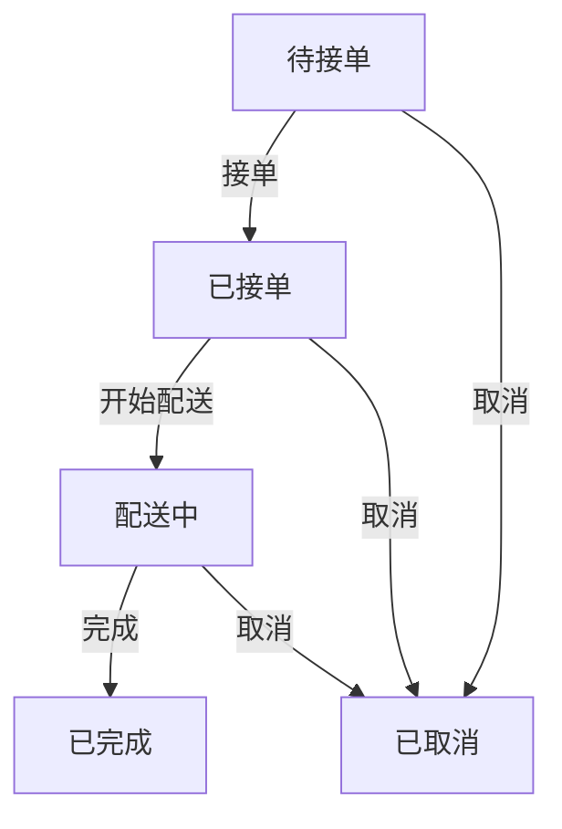

# 微信小程序设计说明文档

## 1. 项目概述
开发一个连接需要代取外卖/快递的用户和想赚外快的兼职人员的平台小程序。

## 2. 小程序架构
- 前端：微信小程序原生框架
- 后端：Node.js + Express
- 数据库：MongoDB

## 3. 主要功能模块
### 3.1 用户端功能
1. 发布需求(外卖/快递)
2. 查看订单状态
3. 支付功能
4. 评价系统
5. 保证金管理
6. 订单状态流转
7. 页面跳转逻辑

### 3.2 兼职端功能
1. 浏览附近订单
2. 接单功能
3. 订单管理
4. 收益结算

## 4. 页面设计
### 4.1 首页
- 展示附近订单
- 快速发布需求入口

### 4.5 页面跳转逻辑
1. **首页 → 发布页**
   - 传递用户当前位置作为默认取货地址
   - 返回时刷新首页订单列表

2. **首页 → 订单详情**
   - 传递订单ID
   - 根据用户角色显示不同操作按钮

3. **个人中心 → 订单列表**
   - 传递用户ID和订单类型筛选条件
   - 返回时保留滚动位置

4. **订单详情 → 评价页**
   - 传递订单ID和对方用户信息
   - 评价完成后更新订单状态

5. **个人中心 → 充值/提现**
   - 传递当前余额信息
   - 操作完成后刷新余额显示

### 4.2 个人中心页
- 用户信息展示与修改
- 订单统计(已完成/已发布)
- 保证金余额展示
- 功能入口(订单/发布/充值/提现)
- 最近订单快捷入口

## 6. UI设计规范
### 6.1 配色方案
- 主色调：#FF7F50 (珊瑚橙)
- 辅助色：#FFD700 (金色)
- 文字色：#333333 (深灰)
- 成功色：#4CAF50
- 警告色：#FFC107
- 错误色：#F44336

### 6.2 字体规范
- 标题：17px 加粗
- 正文：14px 常规
- 辅助文字：12px 浅灰

### 6.3 按钮样式
- 主要按钮：圆角8px，主色调填充
- 次要按钮：圆角8px，白色填充+主色调边框

### 6.4 图标规范
- 使用Material Design风格图标
- 尺寸统一为24x24px

### 6.5 组件规范
#### 按钮
- 主要按钮：高度44px，圆角8px，主色调填充，白色文字
- 次要按钮：高度44px，圆角8px，白色填充，主色调边框和文字
- 禁用状态：透明度50%

#### 输入框
- 高度40px，圆角4px，边框1px #E0E0E0
- 聚焦状态：边框2px 主色调
- 错误状态：边框2px 错误色

#### 卡片
- 圆角8px，阴影0 2px 8px rgba(0,0,0,0.1)
- 内边距16px

#### 标签
- 状态标签：圆角4px，内边距4px 8px
  - 待接单：浅蓝色背景
  - 已接单：浅绿色背景
  - 配送中：浅黄色背景
  - 已完成：浅灰色背景
  - 已取消：浅红色背景

## 7. API接口文档
### 7.1 用户相关
#### 错误码规范
- 4000: 参数缺失
- 4001: 参数格式错误
- 4010: 未授权
- 4030: 权限不足
- 4040: 资源不存在
- 5000: 服务器内部错误

### 7.2 订单相关
#### 错误码规范
- 4002: 订单状态不合法
- 4003: 保证金不足
- 4004: 订单已过期
- 4005: 超出取消时限
- 4006: 距离超出范围

### 7.3 保证金相关
#### 错误码规范
- 4007: 低于最低充值金额
- 4008: 低于最低提现金额
- 4009: 余额不足
- 获取用户信息: GET /api/user/info
- 更新头像: POST /api/user/avatar
- 更新昵称: POST /api/user/nickname

### 7.2 订单相关
- 获取订单列表: GET /api/orders
- 获取订单详情: GET /api/orders/{id}
- 创建订单: POST /api/orders
- 更新订单状态: PUT /api/orders/{id}/status

### 7.3 保证金相关
- 获取保证金余额: GET /api/deposit/balance
- 充值保证金: POST /api/deposit/recharge
- 提现保证金: POST /api/deposit/withdraw

### 8.2 保证金管理规则
1. **充值规则**
   - 最低充值金额: 10元
   - 充值方式: 微信支付
   - 充值即时到账

2. **提现规则**
   - 最低提现金额: 20元
   - 提现申请后24小时内处理
   - 提现手续费: 1元/笔

3. **资金冻结机制**
   - 接单时冻结订单金额120%的保证金
   - 订单完成后解冻并结算
   - 争议订单资金保持冻结直至解决

4. **保证金用途**
   - 保证兼职人员履约
   - 赔付用户损失
   - 支付违约金

## 8. 数据库字段说明
### 8.1 用户表(users)
#### 索引设计
- 主键索引：_id
- 唯一索引：openid
- 普通索引：score (用于信用评分排序)
- 复合索引：createdAt + score (用于新用户推荐)

### 8.2 订单表(orders)
#### 索引设计
- 主键索引：_id
- 普通索引：userId (用户查询)
- 复合索引：status + createdAt (订单状态筛选)
- 地理索引：pickupLocation (附近订单查询)
- 复合索引：type + status (服务类型筛选)
- _id: ObjectId
- openid: String
- nickname: String
- avatar: String
- score: Number
- deposit: Number
- createdAt: Date
- updatedAt: Date

### 8.2 订单表(orders)
- _id: ObjectId
- userId: ObjectId
- type: String
- pickupLocation: String
- deliveryLocation: String
- reward: Number
- trackingNumber: String
- phone: String
- description: String
- status: String
- createdAt: Date
- updatedAt: Date
- 主色调：#FF7F50 (珊瑚橙)
- 辅助色：#FFD700 (金色)
- 文字色：#333333 (深灰)
- 成功色：#4CAF50
- 警告色：#FFC107
- 错误色：#F44336

### 6.5 组件规范
#### 按钮
- 主要按钮：高度44px，圆角8px，主色调填充，白色文字
- 次要按钮：高度44px，圆角8px，白色填充，主色调边框和文字
- 禁用状态：透明度50%

#### 输入框
- 高度40px，圆角4px，边框1px #E0E0E0
- 聚焦状态：边框2px 主色调
- 错误状态：边框2px 错误色

#### 卡片
- 圆角8px，阴影0 2px 8px rgba(0,0,0,0.1)
- 内边距16px

#### 标签
- 状态标签：圆角4px，内边距4px 8px
  - 待接单：浅蓝色背景
  - 已接单：浅绿色背景
  - 配送中：浅黄色背景
  - 已完成：浅灰色背景
  - 已取消：浅红色背景

### 6.2 字体规范
- 标题：17px 加粗
- 正文：14px 常规
- 辅助文字：12px 浅灰

### 6.3 按钮样式
- 主要按钮：圆角8px，主色调填充
- 次要按钮：圆角8px，白色填充+主色调边框

### 6.4 图标规范
- 使用Material Design风格图标
- 尺寸统一为24x24px

### 4.2 发布需求页
- 选择服务类型(外卖/快递)
- 填写详细需求
- 设置报酬金额

### 4.3 订单列表页
- 用户/兼职人员的订单列表
- 订单状态显示

### 4.4 个人中心页
- 用户信息
- 钱包功能
- 历史记录

## 5. 数据库设计
### 5.1 用户表
- 用户ID: String (主键)
- 基本信息: Object {
  - 姓名: String
  - 手机: String
  - 头像: String
  - 地址: Object {
    - 经度: Number
    - 纬度: Number
    - 详细地址: String
  }
}
- 信用评分: Number (0-5)
- 钱包余额: Number
- 注册时间: Date

### 5.2 订单表
- 订单ID: String (主键)
- 服务类型: String (enum: ['外卖','快递'])
- 状态: String (enum: ['待接单','已接单','配送中','已完成','已取消'])
- 报酬金额: Number
- 创建时间: Date
- 完成时间: Date
- 用户ID: String (外键)
- 兼职ID: String (外键)
- 需求详情: String
- 取货地址: Object {
  - 经度: Number
  - 纬度: Number
  - 详细地址: String
}
- 送货地址: Object {
  - 经度: Number
  - 纬度: Number
  - 详细地址: String
}
- 评价: Object {
  - 评分: Number (1-5)
  - 评价内容: String
}

## 6. 服务器配置
1. 使用Express搭建RESTful API
2. 实现JWT身份验证
3. 配置MongoDB连接

## 7. API接口说明
### 用户相关
- POST /api/user/register 用户注册
- POST /api/user/login 用户登录
- GET /api/user/info 获取用户信息
- PUT /api/user/info 更新用户信息

### 订单相关
- POST /api/order/create 创建订单
- GET /api/order/list 获取订单列表
- GET /api/order/detail/:id 获取订单详情
- PUT /api/order/accept/:id 接单
- PUT /api/order/complete/:id 完成订单
- PUT /api/order/cancel/:id 取消订单

### 支付相关
- POST /api/payment/recharge 充值
- POST /api/payment/withdraw 提现
- POST /api/payment/pay 支付订单

## 7. 开发流程
1. 前端页面开发
2. 后端API开发
3. 数据库连接
4. 测试部署

## 8. 订单状态流转图

### 8.1 状态转换规则
1. **待接单 → 已接单**
   - 兼职人员点击"接单"按钮
   - 系统验证兼职人员保证金余额≥订单报酬
   - 系统冻结相应保证金

2. **已接单 → 配送中**
   - 兼职人员到达取货地点后点击"开始配送"
   - 系统记录开始时间
   - 推送通知给用户
// 封装基础请求方法
const request = (url, method, data) => {
  return new Promise((resolve, reject) => {
    wx.request({
      url: `https://your-domain.com${url}`,
      method,
      data,
      header: {
        'Content-Type': 'application/json',
        'Authorization': `Bearer ${wx.getStorageSync('token')}`
      },
      success: (res) => {
        if (res.statusCode === 200) {
          resolve(res.data)
        } else {
          reject(res.data)
        }
      },
      fail: (err) => reject(err)
    })
  })
}
3. **配送中 → 已完成**
   - 兼职人员到达送货地点后点击"完成配送"
   - 用户确认收货
   - 系统解冻保证金并结算给兼职人员
   - 双方可互相评价

4. **取消规则**
   - 用户可在"待接单"状态随时取消
   - 兼职人员接单后30分钟内可无责取消
   - 超时取消需扣除部分保证金作为违约金
   - 系统自动取消超时未接单的订单(30分钟)

5. **异常处理**
   - 配送超时(2小时未完成)自动转为异常状态
   - 客服可介入处理争议订单
   - 争议期间相关资金保持冻结